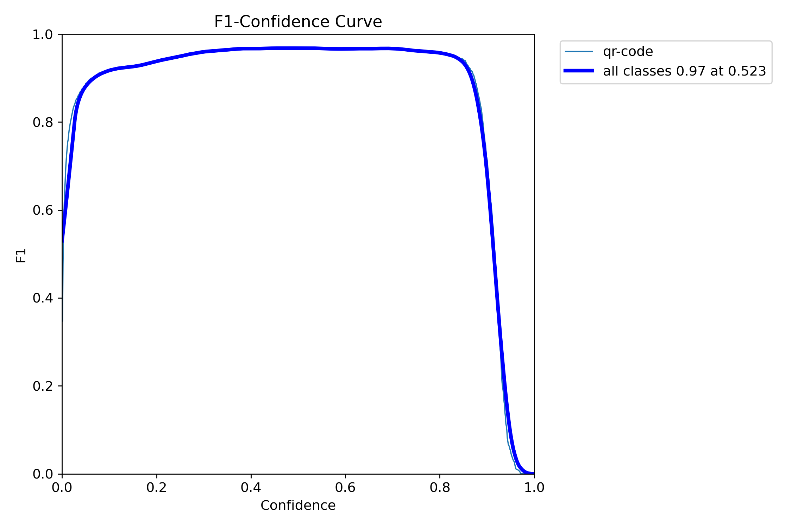
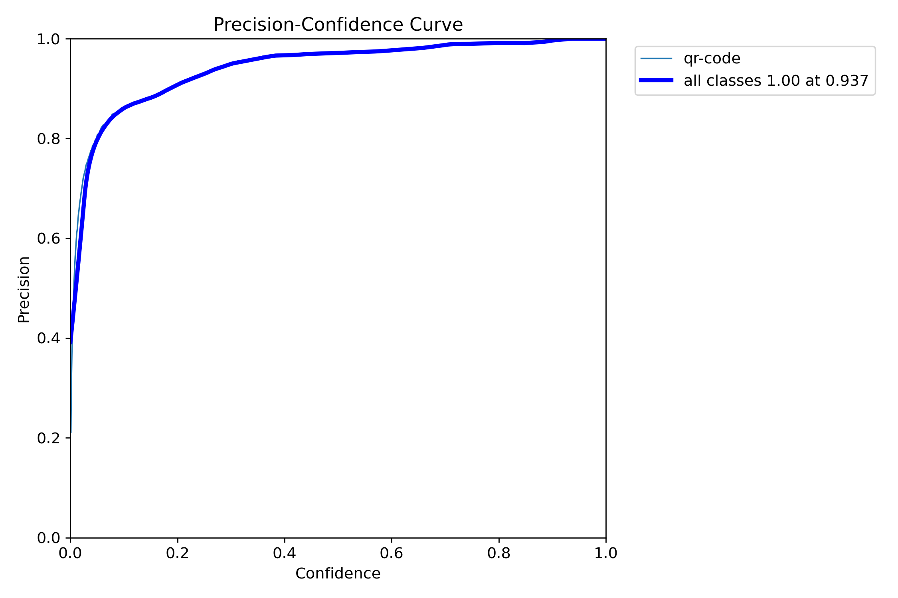
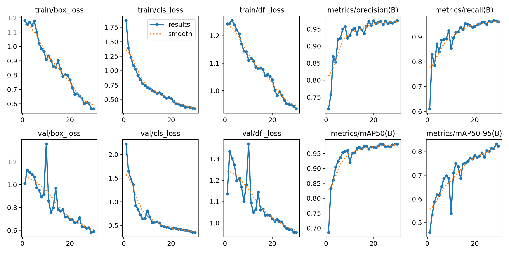
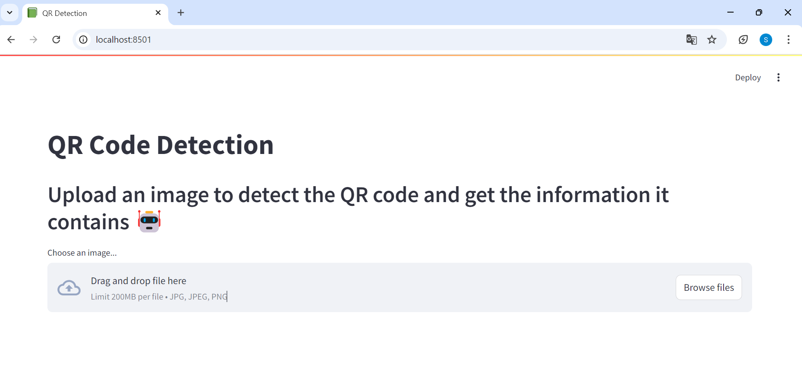

# QR Detection and Information Extraction

This project implements a **QR code detection** system using the **YOLOv8n** model along with a simple frontend built in **Streamlit**. The system is capable of detecting QR codes in images, extracting their content, and drawing bounding boxes around the detected QR codes.

## Table of Contents
1. [File Structure](#file-structure)
2. [Model Used](#model-used)
   - [Why YOLOv8n Pre-trained Model?](#why-yolov8n-pre-trained-model)
3. [Data Used](#data-used)
4. [Data Augmentation](#data-augmentation)
5. [Model Training](#model-training)
   - [Training Results](#training-results)
6. [Set up](#set-up)
   - [Prerequisites](#prerequisites)
   - [Steps](#steps)
7. [How to Use the Frontend](#how-to-use-the-frontend)
8. [Contact](#contact)

## File Structure
Here’s an overview of the project’s directory structure:
```
├── api/                        # Backend folder
│   ├── __init__.py
│   ├── config.py                # Configuration settings for the API
│   ├── main.py                  # FastAPI entry point for backend
│   ├── models.py                # YOLO model loading and prediction
│   ├── predict.py               # Prediction logic
│   ├── schemas.py               # Data schemas for API responses
│   └── utils.py                 # Utility functions for QR code decoding
│
├── frontend/                    # Streamlit frontend
│   └── app.py                   # Streamlit app to upload images and display results
│
├── images/                      # Directory containing images for documentation
│   └── (F1_curve.png, etc.)     # Images used for README results
│
├── models/                      # Directory for model-related scripts and data
│   ├── data_aug.py              # Data augmentation script
│   ├── predict.ipynb            # Jupyter Notebook for predictions
│   └── train.py                 # Training script for the YOLOv8 model
│
├── .gitignore                   # Files and folders to be ignored by Git
├── README.md                    # Project documentation
└── requirements.txt             # Python dependencies for the project
```

## Model Used

The model used is **YOLOv8n** (You Only Look Once Nano), a state-of-the-art object detection model optimized for lightweight, real-time applications. 

### Why YOLOv8n Pre-trained Model?

The **YOLOv8n.pt** pre-trained model was chosen for the following reasons:

- **Lightweight**: YOLOv8n is the "nano" version of the YOLO family, optimized for speed and efficiency with smaller model sizes, making it ideal for real-time applications on devices with limited computational resources.
- **Transfer Learning**: By using a pre-trained model, we leverage the general object detection capabilities learned from a large dataset (such as COCO), which helps the model generalize better and converge faster when fine-tuned on a smaller, domain-specific dataset like QR codes.
- **Real-Time Performance**: YOLOv8n is specifically designed to handle real-time object detection tasks, ensuring minimal latency during inference, which is critical for QR code scanning applications.

## Data Used

The dataset used for this project was sourced from [Roboflow's QR Code Detection Dataset](https://universe.roboflow.com/qr-lmsul/qr-code-detection-jz2e3/dataset/2), which includes **1547 images** annotated in YOLOv8 format. This dataset was selected due to its diversity of QR code images, enabling the model to generalize better to different real-world scenarios.

## Data Augmentation

To further improve the model's ability to generalize, several **data augmentation techniques** were applied to the dataset. Data augmentation helps simulate different real-world conditions and improves model robustness. The following transformations were applied to 20% of the images:

- Horizontal and Vertical Flip: Helps the model handle QR codes that may appear upside down or flipped.
- Random Brightness Contrast: Simulates different lighting conditions, ensuring that the model performs well in various lighting environments.
- Gaussian Blur: Reduces overfitting by slightly blurring some images, ensuring the model doesn't rely on sharpness alone.
- Rotation: Randomly rotates the images by up to 10 degrees to handle minor rotations in QR code images.

These transformations allow the model to generalize across different variations in the appearance of QR codes, making it robust to real-world changes in QR code orientation, lighting, and noise.

## Model Training
The model was trained using the [Ultralytics YOLOv8 framework](https://www.ultralytics.com/es). The training process involved a dataset of annotated QR code images. The following hyperparameters were used:

- Image Size: 640x640 pixels
- Epochs: 30
- Optimizer: auto
- Patiente: 5

### Training Results

The model's performance was evaluated using the following key metrics, generated during training using the **YOLOv8n.pt** pre-trained model. The results demonstrate the balance between precision, recall, and F1 score across different confidence thresholds.

#### 1. **F1-Confidence Curve**


This curve shows the balance between precision and recall at different confidence levels. The **F1 score** reaches a maximum of **0.97** at a confidence threshold of **0.523**. This indicates that the model maintains a high balance of precision and recall at this confidence level, making it suitable for reliable QR code detection.

#### 2. **Precision-Confidence Curve**


The **Precision-Confidence curve** shows how the precision varies as the confidence threshold increases. At a confidence of **0.937**, the precision is **1.00**, indicating that the model makes very few false-positive predictions at high confidence levels. This is crucial for QR code detection since false positives can lead to incorrect extractions.

#### 3. **Training Loss and Performance Metrics**


- **Train/Box Loss** and **Val/Box Loss**: These curves show how the bounding box regression loss decreases over the training epochs for both the training and validation sets. The steady reduction in loss indicates that the model learns to accurately localize QR codes over time.

- **Train/Cls Loss** and **Val/Cls Loss**: The classification loss decreases steadily for both training and validation, indicating that the model is learning to correctly classify the QR codes during detection.

- **Precision and Recall**: The precision increases steadily, reaching **0.98** by the end of training, while recall also improves, showing that the model is able to retrieve nearly all QR codes in the validation set.

- **mAP@50** and **mAP@50-95**: These metrics show that the model achieves high accuracy in detecting QR codes at various thresholds, with **mAP@50** reaching **0.97**, and **mAP@50-95** around **0.80**, demonstrating robust performance across different IoU (Intersection over Union) thresholds.

## Set up

To set up the project and get it running, follow these steps:

### Prerequisites

Ensure you have the following installed:
- **Python 3.8+**
- **Pip** (for installing dependencies)

### Steps

1. **Clone the repository**:
   ```bash
   git clone https://github.com/your-repo/qr-code-detection.git
   cd qr-code-detection
   ```
2. **Create a virtual environment (optional but recommended)**:
   ```bash
   python -m venv .venv
   source .venv/bin/activate  # For Linux/MacOS
   .venv\Scripts\activate     # For Windows
   ```
3. **Install the required dependencies**:
   ```bash
   pip install -r requirements.txt
   ```
4. **Run the API**:
   ```bash
   uvicorn api.main:app --reload
   ```
   This will start the FastAPI server locally at http://127.0.0.1:8000.

5. **Run the Frontend**: Navigate to the frontend directory and run the Streamlit application:
   ```bash
   streamlit run frontend/app.py
   ```
   The frontend Streamlit application run at http://localhost:8501

## How to Use the Frontend



The frontend is a **Streamlit** application that allows users to upload images and view the results of the QR code detection, including the bounding boxes drawn around the detected QR codes and the extracted QR code content.

1. **Upload an Image**:
   - Click the **"Browse files"** button to upload an image (supported formats: `.jpg`, `.jpeg`, `.png`).
   - Once the image is uploaded, it will be displayed on the page as the **"Original Image"**.

2. **View Detection Results**:
   - After uploading the image, the app will send the image to the backend API for processing.
   - The detected QR codes will be displayed below the image with:
     - **Bounding Box Coordinates**: Showing the coordinates of the QR code within the image.
     - **QR Code Content**: The extracted information from the detected QR code (if available).

3. **View Bounding Boxes**:
   - Click the **"Show Bounding Boxes"** button to see the image with bounding boxes drawn around the detected QR codes. The image will update to show the boxes, indicating where the QR codes were detected.

### Example Flow

- **Step 1**: Upload the image.
- **Step 2**: View the original image on the page.
- **Step 3**: See the detection results with the QR code content and bounding box coordinates.
- **Step 4**: Click the button to overlay bounding boxes on the image.

This makes it easy to detect and extract information from QR codes in images, all within a simple and intuitive web interface.
   
## Contact
If you have any questions, comments or suggestions, please feel free to contact me:

- Sara Cardona: cardonasara571@gmail.com
- Project link: [https://github.com/scardonac/income_prediction](https://github.com/scardonac/qr_code_detection)
